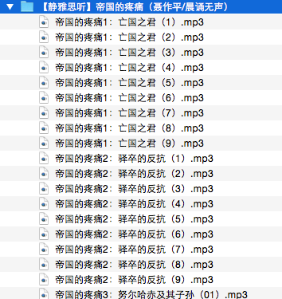
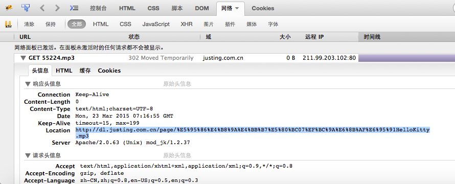

## 静雅思听Podcast批量抓取工具

<!--

-->

###I 前言

[静雅思听](http://justing.com.cn/ "静雅思听") 是一个制作精良、内容优质的有声书类型的Podcast，有声书无论从选题、朗读还是背景音，在同类的有声书中也算是数一数二的。

作为一个老的Podcast听众，前后在静雅思听上听过好几本有声书了。尽管也看书，但有些书，尤其是历史题材的书，听出色的播音（比如下面提到的晟焕）像讲故事那样读出来，感觉是非常不一样的。下面的几个是我听过不错的几个：

* 《明朝出了个张居正》（清秋子/晟焕）
* 《帝国的疼痛》（聂作平/晨诵无声）
* 《女人当国》（金满楼/晟焕）

作为静雅思听的iPhone客户端付费用户（不知道为什么静雅思听的付费模式那么的繁杂 O__O"…），我一直认为对于内容的付费是值得的，一则因为时间是宝贵的，与其四处找下载，不如花点钱节省下时间去听更多的内容；二则优质内容的制作是非常耗时耗力的，付费也是对于作者继续制作更加精良内容的报偿和鼓励。

但是，**尽管付费，网站仍没有提供一个可以打包下载的功能**，对于一本书动辄几十个文件，一个一个下载mp3是在是令人恼火的事情。

于是技术的强迫症又犯了，打算通过基于 Python 的页面抓取框架 [Scrapy](http://scrapy.org/) 对mp3进行批量下载。

> 那么，问题来了，下载？地址是什么？

###Ⅱ 思路
节目名称作为入参，抓取器通过网站提供的搜索功能获取节目列表，分析并获取详情页地址，然后下载相应的音频文件。

> Just do it!

###Ⅲ 分析

####1. 搜索结果页的获取
通过 firebug 分析站点 [搜索页面](http://justing.com.cn/search_action.jsp "搜索页") 获取搜索页结果页

获取模拟搜索功能的参数

请求地址: http://justing.com.cn/search_action.jsp

请求方法: POST

请求参数: searchType=name&searchWord=历史

####2. 搜索结果页的解析
继续通过 firebug 分析搜索结果列表页

观察可得列表项包含title标题和详情页地址，并且通过View XPath验证得到列表项的xpath表达式为

  **//div[@class='result']/h1/a**

####3. MP3资源地址的获取

上一步得到了列表项资源的title和详情页url，那么，mp3资源地址如何获得，还是通过 firebug 追踪详情页的的播放过程，看看服务器是从哪里获取得到的资源

可见，服务器通过302错误重定向，在Location域中提供了mp3资源的真正地址，并且显而易见，是将title字段通过url编码encode后，拼接在 http://dl.justing.com.cn/page/ 后面得到的，即

**资源地址公式：http://dl.justing.com.cn/page/ + url_code( remove_space(title) ) + .mp3**

###Ⅳ 执行

现在，我们可以通过想要节目的名称（比如：明朝出了个张居正），通过搜索页获取和解析，得到所有节目的标题title，在通过资源地址公式，得到所有资源的地址。很简单，对吧！

下面我们就可以在 Scrapy 的 Spider 中完成搜索结果页的抓取、解析，以及资源地址的拼接，最后通过 Pipeline 保存下载的mp3文件即可。

####Scrapy框架下载文件
参考了stackoverflow中的一个[解决方案](http://stackoverflow.com/questions/7123387/should-i-create-pipeline-to-save-files-with-scrapy)，决定采用Spider中发送下载请求，通过返回的Response.body构造item，随后在Pipeline中保存到文件中来实现。

####文明抓取
为了不对静雅思听服务器造成过高负载压力，将爬虫并发限制为2，在setting.py中设置如下

**CONCURRENT_REQUEST=2**

###Ⅴ 结果

项目完成后，以"hello"作为关键词抓取，结果如下

> Bingo!

###Ⅵ 后记

通过这样的批量下载的方式，竟然可以绕过站点的VIP收费机制，直接对资源进行下载，OMG！

**( ⊙ o ⊙ )啊！**

---

*该项目仅供技术研究，如有需要，希望大家购买VIP权限后，再自行批量下载。优质资源需要我们一起维持*

*powered by [Mou](http://25.io/mou/)*
